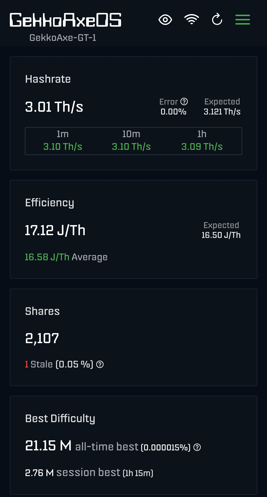
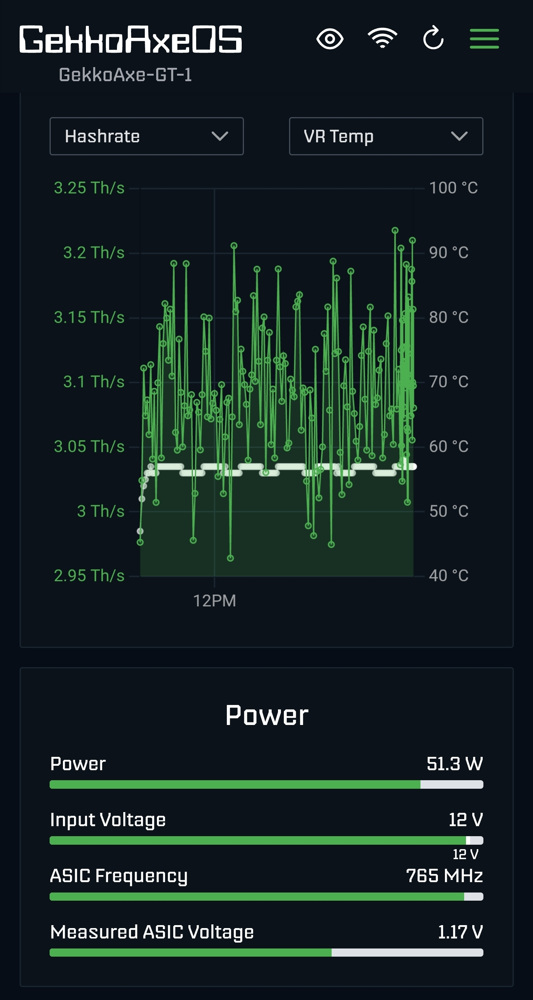
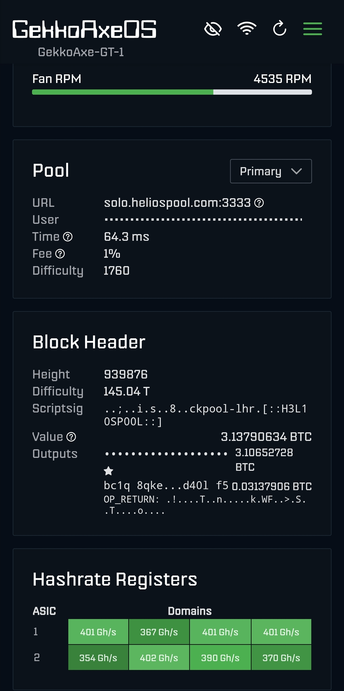
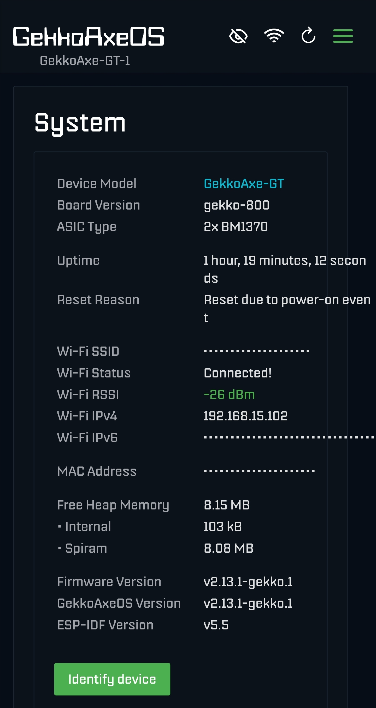

<sub>Thinking of getting your own GekkoScience miner? Support the author by using this affiliate [link](https://www.gekkoscience.com/?aff=12).</sub>


# GekkoAxeOS

GekkoAxeOS is open-source community firmware for the **[GekkoAxe](https://github.com/sidehack-gekko/GekkoAxe)** line of Bitcoin miners by [GekkоScience](https://www.gekkoscience.com). It is a fork of [bitaxeorg/ESP-Miner](https://github.com/bitaxeorg/ESP-Miner), tracking upstream closely. This project is not affiliated with GekkоScience.

For pre-built images ready to flash, see the [latest release](https://github.com/Z3r0XG/GekkoAxeOS/releases/latest).

<a href="media/GekkoAxeOS-hashrate.jpg"></a>
<a href="media/GekkoAxeOS-graph.jpg"></a>
<a href="media/GekkoAxeOS-pool.jpg"></a>
<a href="media/GekkoAxeOS-system.jpg"></a>

---

## Supported Hardware

### GekkoAxe GT

| Parameter | Value |
|---|---|
| Board version | `gekko-800` |
| ASICs | 2× BM1370 |
| Device family | `GekkoAxe-GT` |
| Voltage regulator | TPS546 (multi-phase) |
| Fan controller | EMC2103 |
| MCU | ESP32-S3-WROOM-1 N16R8 (16 MB Flash, 8 MB Octal SPI PSRAM) |
| Input voltage | 12 V |
| Default ASIC frequency | 600 MHz |
| Default ASIC voltage | 1100 mV |

### GekkoAxe Gamma 5 V

| Parameter | Value |
|---|---|
| Board version | `gekko-601` |
| ASICs | 1× BM1370 |
| Device family | `GekkoAxe-γ` |
| Voltage regulator | TPS546 |
| Fan controller | EMC2101 |
| MCU | ESP32-S3-WROOM-1 N16R8 (16 MB Flash, 8 MB Octal SPI PSRAM) |
| Input voltage | 5 V |
| Default ASIC frequency | 525 MHz |
| Default ASIC voltage | 1150 mV |

### GekkoAxe Gamma 12 V

Hardware specification details are pending confirmation.

---

## Changes vs upstream ESP-Miner

- **GekkoAxe hardware support** — dedicated device family entries for each board variant (`GekkoAxe-GT`, `GekkoAxe-γ`) with correct regulator config, fan controller, and board-specific power parameters
- **Per-device stratum user-agent** — identifies as `GekkoAxe-GT/{version}`, `GekkoAxe-γ/{version}` instead of `bitaxe/...`
- **NVS-configurable TPS546 VIN limits** — `vin_on`, `vin_off`, and `vin_ov_fault` NVS keys allow per-board override of TPS546 input voltage thresholds (see [NVS voltage configuration](#nvs-voltage-configuration))
- **GekkoAxeOS branding** — UI title, page labels, and topbar reflect GekkoAxeOS; favicon replaced with GekkoScience logo
- **Logs page improvements** — configurable log buffer size (50–5000 lines) with +/- controls; download logs as a clean `.txt` file
- **WiFi AP renamed** — setup-mode access point shows as `GekkoAxe_XXYY` instead of `Bitaxe_XXYY`
- **Last submitted share diff** — live `lastSubmittedDiff` stat in `/api/system/info` and selectable as a chart series on the dashboard
- **OTA updates point to this repo** — the in-UI update checker and OTA download resolve releases from `Z3r0XG/GekkoAxeOS` instead of `bitaxeorg/ESP-Miner`
- **OTA file naming** — firmware OTA expects `gekkoaxe-firmware-*.bin`; web OTA expects `gekkoaxe-www-*.bin`

---

## Flashing a release

### Factory flash (first-time or full reset)

The factory image contains the bootloader, partition table, firmware, web UI, and board-specific NVS config all merged into a single file. Flash it at address `0x0`. **Use the factory image that matches your board.**

**Option A — bitaxetool (command line)**

> bitaxetool v0.6.1 is required (locked to esptool v4.9.0). esptool v5.x is not compatible.

```bash
pip install bitaxetool==0.6.1

# GekkoAxe GT
bitaxetool --config ./config-GekkoAxe_GT.cvs --firmware ./gekkoaxe-factory-GekkoAxe_GT-{VERSION}.bin
```

**Option B — esptool directly**

```bash
esptool.py --chip esp32s3 -b 921600 --before default_reset --after hard_reset \
  write_flash --flash_mode dio --flash_size 16MB --flash_freq 80m \
  0x0 gekkoaxe-factory-GekkoAxe_GT-{VERSION}.bin
```

### OTA update (device already running GekkoAxeOS)

Navigate to your device's web UI → **Settings** → **Updates**.

- **Firmware update**: upload `gekkoaxe-firmware-{VERSION}.bin` (all boards share the same firmware binary)
- **Web UI update**: upload `gekkoaxe-www-{VERSION}.bin` (all boards share the same web UI binary)

The in-UI update checker automatically compares against the latest release on this repository.

---

## Administration

Once the device is connected to Wi-Fi, the web UI is accessible at:

- `http://<device-ip>` — main UI
- `http://GekkoAxe` — mDNS alias (if your router supports it)
- `http://<device-ip>/recovery` — recovery page if the main UI is inaccessible (e.g. after a failed www update)

### Unlock overclocking settings

Append `?oc` to the Settings tab URL to unlock ASIC frequency and core voltage fields. Use with adequate cooling — overclocking without it can damage the hardware.

---

## GekkoAxeOS API

The web server on port 80 exposes a REST API. Full spec: [`main/http_server/openapi.yaml`](./main/http_server/openapi.yaml).

**GET**
- `/api/system/info` — system information (hashrate, temps, uptime, pool, `lastSubmittedDiff`, etc.)
- `/api/system/asic` — ASIC settings
- `/api/system/statistics?columns=...` — historical stats ring buffer (720 entries)
- `/api/system/statistics/dashboard` — dashboard stats
- `/api/system/wifi/scan` — available Wi-Fi networks

**POST**
- `/api/system/restart` — restart the device
- `/api/system/identify` — flash LEDs / beep
- `/api/system/OTA` — upload firmware binary
- `/api/system/OTAWWW` — upload web UI binary

**PATCH**
- `/api/system` — update settings (pool, Wi-Fi, fan speed, voltage, frequency, etc.)

```bash
# Current system info
curl http://<device-ip>/api/system/info

# Last submitted share difficulty
curl http://<device-ip>/api/system/info | python3 -m json.tool | grep lastSubmittedDiff

# Update fan speed
curl -X PATCH http://<device-ip>/api/system \
     -H "Content-Type: application/json" \
     -d '{"fanspeed": 80}'

# OTA firmware update
curl -X POST \
     -H "Content-Type: application/octet-stream" \
     --data-binary "@gekkoaxe-firmware-{VERSION}.bin" \
     http://<device-ip>/api/system/OTA
```

---

## Building from source

### Prerequisites

- [ESP-IDF v5.5](https://docs.espressif.com/projects/esp-idf/en/v5.5/esp32s3/get-started/) targeting `esp32s3`
- Node.js ≥ 22 and npm (for the Angular web UI)
- Linux or macOS recommended

### Quick setup

```bash
# Clone this repo
git clone https://github.com/Z3r0XG/GekkoAxeOS.git
cd GekkoAxeOS

# Install ESP-IDF v5.5
git clone --branch v5.5 --depth 1 --recursive https://github.com/espressif/esp-idf.git ~/esp/idf
~/esp/idf/install.sh esp32s3
```

### Build

```bash
bash build_release.sh
```

This sources ESP-IDF, builds the full firmware + Angular web UI, and produces per-board factory images plus shared firmware/www artifacts in `releases/{VERSION}/`:

| File | Use |
|---|---|
| `gekkoaxe-factory-{BOARD}-{VERSION}.bin` | Full 16 MB factory image for each board, flash at `0x0` |
| `gekkoaxe-firmware-{VERSION}.bin` | Firmware only, for OTA Firmware update (all boards) |
| `gekkoaxe-www-{VERSION}.bin` | Web UI only, for OTA Web update (all boards) |
| `config-{BOARD}.cvs` | NVS config used to build each factory image |

To skip the ESP-IDF build and re-package only (after a web UI change):

```bash
bash build_release.sh --no-build
```

---

## NVS voltage configuration

The TPS546 voltage regulator's input voltage thresholds are configurable via NVS keys baked into each board's `config-GekkoAxe_*.cvs` file. This allows the same firmware binary to safely operate across different input voltage configurations.

| NVS key | Type | Default | Description |
|---|---|---|---|
| `vin_on` | float (string) | `0` (use family default) | Minimum input voltage to enable the regulator (V) |
| `vin_off` | float (string) | `0` (use family default) | Input voltage below which the regulator shuts off (V) |
| `vin_ov_fault` | float (string) | `0` (use family default) | Input overvoltage fault threshold (V) |

When any key is `0` (or absent), the firmware falls back to the family default for the detected board.

**GekkoAxe GT (12 V input):**

```
vin_on,data,string,11.0
vin_off,data,string,10.5
vin_ov_fault,data,string,14.0
```

---

## Credits

GekkoAxeOS is built on [ESP-Miner](https://github.com/bitaxeorg/ESP-Miner) by the Bitaxe community. All upstream contributors retain their credit — this fork adds GekkoAxe hardware support and UI features on top of their work.

## Attributions

The display font is Portfolio 6x8 from https://int10h.org/oldschool-pc-fonts/ by VileR.

