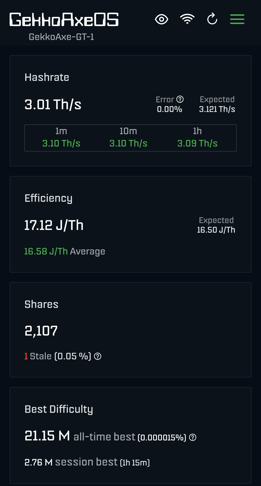
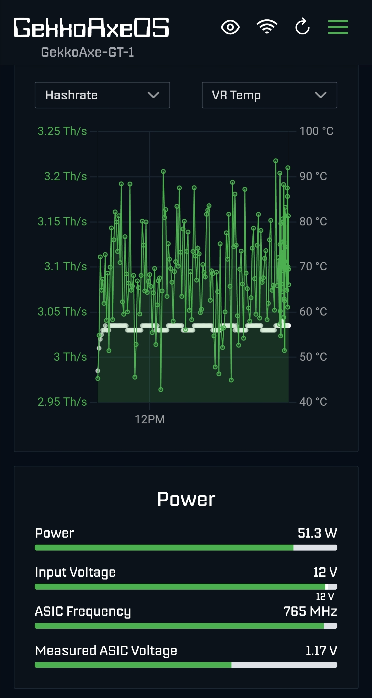
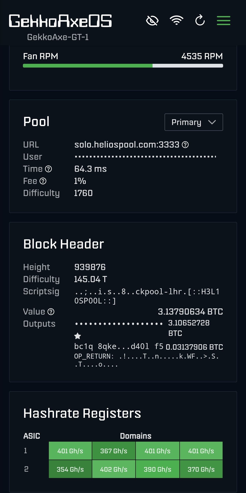
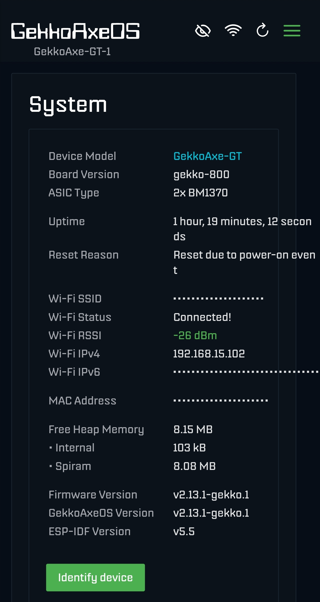

<sub>Thinking of getting your own GekkoScience miner? Support the author by using this affiliate [link](https://www.gekkoscience.com/?aff=12).</sub>


# GekkoAxeOS

GekkoAxeOS is open-source community firmware for the **[GekkoAxe](https://github.com/sidehack-gekko/GekkoAxe)** line of Bitcoin miners by [GekkоScience](https://www.gekkoscience.com). It is a fork of [bitaxeorg/ESP-Miner](https://github.com/bitaxeorg/ESP-Miner), tracking upstream closely. This project is not affiliated with GekkоScience.

For pre-built images ready to flash, see the [latest release](https://github.com/Z3r0XG/GekkoAxeOS/releases/latest).

<a href="media/GekkoAxeOS-hashrate.jpg"></a>
<a href="media/GekkoAxeOS-graph.jpg"></a>
<a href="media/GekkoAxeOS-pool.jpg"></a>
<a href="media/GekkoAxeOS-system.jpg"></a>

---

## GekkoAxe Hardware

### GekkoAxe GT

| Parameter | Value |
|---|---|
| Board version | `gekko-800` |
| ASICs | 2× BM1370 |
| Device family | `GekkoAxe-GT` |
| Voltage regulator | TPS546 (multi-phase) |
| Fan controller | EMC2103 |
| MCU | ESP32-S3-WROOM-1 N16R8 (16 MB Flash, 8 MB Octal SPI PSRAM) |
| Input voltage | 12 V |
| Default ASIC frequency | 600 MHz |
| Default ASIC voltage | 1100 mV |

### GekkoAxe Gamma 5 V

| Parameter | Value |
|---|---|
| Board version | `gekko-601` |
| ASICs | 1× BM1370 |
| Device family | `GekkoAxe-γ` |
| Voltage regulator | TPS546 |
| Fan controller | EMC2101 |
| MCU | ESP32-S3-WROOM-1 N16R8 (16 MB Flash, 8 MB Octal SPI PSRAM) |
| Input voltage | 5 V |
| Default ASIC frequency | 600 MHz |
| Default ASIC voltage | 1100 mV |

### GekkoAxe Gamma 12 V

| Parameter | Value |
|---|---|
| Board version | `gekko-601-12` |
| ASICs | 1× BM1370 |
| Device family | `GekkoAxe-γ` |
| Voltage regulator | TPS546 |
| Fan controller | EMC2101 |
| MCU | ESP32-S3-WROOM-1 N16R8 (16 MB Flash, 8 MB Octal SPI PSRAM) |
| Input voltage | 12 V |
| Default ASIC frequency | 600 MHz |
| Default ASIC voltage | 1100 mV |

> **Note:** `gekko-601` (5 V) uses the upstream ESP-Miner `601` configuration. `gekko-601-12` (12 V) adapts that config for 12 V input.

---

## Changes vs upstream ESP-Miner

### Hardware & board support

- **GekkoAxe hardware support** — dedicated device family entries for each board variant (`GekkoAxe-GT`, `GekkoAxe-γ`) with correct regulator config, fan controller, and board-specific power parameters
- **Per-device stratum user-agent** — identifies as `GekkoAxe-GT/{version}`, `GekkoAxe-γ/{version}` instead of `bitaxe/...`
- **Self-test power ceiling corrected** — `gekko-800` `power_consumption_target` fixed from 12 W to 36 W (matches `gekko-801`; was a dormant upstream copy-paste bug, only affects devices with `selftest=1`)
- **Fan controller improvements** — Auto fan continues working if any individual ASIC temperature sensor stops reporting; fails safe to 100% if all sensors are lost; more aggressive response to rising temperatures with a gradual spin-down to prevent oscillation

### Branding & identity

- **GekkoAxeOS branding** — UI title, page labels, and topbar reflect GekkoAxeOS; favicon replaced with GekkoScience logo
- **Boot logo screens** — GekkoAxe logo (128×22, RGB565) replaces the BitAxe logo on the first boot splash, with device name and board version stacked below; GekkoScience logo (128×32, RGB565) shown on the second boot splash
- **WiFi AP renamed** — setup-mode access point shows as `GekkoAxe_XXYY` instead of `Bitaxe_XXYY`

### OTA

- **OTA updates point to this repo** — the in-UI update checker and OTA download resolve releases from `Z3r0XG/GekkoAxeOS` instead of `bitaxeorg/ESP-Miner`
- **OTA file naming** — firmware OTA expects `esp-miner-gekko.bin`; web OTA expects `www-gekko.bin` (old `gekkoaxe-firmware-*.bin` / `gekkoaxe-www-*.bin` names are still accepted)

### Web UI & dashboard

- **Logs page improvements** — configurable log buffer size (50–5000 lines) with +/- controls; download logs as a clean `.txt` file
- **Expert Mode toggle** — Settings page toggle replaces the `?oc` URL parameter for enabling custom ASIC frequency and voltage; persists to NVS
- **Last submitted share diff** — live `lastSubmittedDiff` stat in `/api/system/info` and selectable as a chart series on the dashboard
- **Board temperature** — EMC fan controller internal die temperature exposed as `boardTemp` in `/api/system/info`, shown as a progress bar in the Heat card, and available as a chart series on the dashboard
- **Jobs counter** — stratum work received since last pool connection exposed as `workReceived` in `/api/system/info`, shown in the Shares card

### Configuration & tuning

- **Stratum connection tuning** — `strat_retry`, `strat_crit_rty`, and `strat_timeout` are NVS-configurable via CVS file; see [Stratum — connection tuning](./doc/configuration.md#stratum--connection-tuning)
- **Self-test parameter tuning** — `st_difficulty`, `st_pwr_margin`, `st_vcore_min`, and `st_vcore_max` are NVS-configurable via CVS file; see [Self-test parameters](./doc/configuration.md#self-test-parameters)
- **Danger zone NVS keys** — `dangerzone=1` in the CVS file unlocks thermal thresholds, fan PID gains, and TPS546 VIN limits (`vin_on`, `vin_off`, `vin_ov_fault`) without editing source code; see [Danger zone](./doc/configuration.md#danger-zone) in the configuration reference
---

## Building from source

### Prerequisites

- [ESP-IDF v5.5](https://docs.espressif.com/projects/esp-idf/en/v5.5/esp32s3/get-started/) targeting `esp32s3`
- Node.js ≥ 22 and npm (for the Angular web UI)
- Linux or macOS recommended

### Quick setup

```bash
# Clone this repo
git clone https://github.com/Z3r0XG/GekkoAxeOS.git
cd GekkoAxeOS

# Install ESP-IDF v5.5
git clone --branch v5.5 --depth 1 --recursive https://github.com/espressif/esp-idf.git ~/esp/idf
~/esp/idf/install.sh esp32s3
```

### Build

```bash
# Build the Angular web UI first
cd main/http_server/axe-os && npm ci && npm run build && cd ../../..

# Build firmware
idf.py build
```

To produce a merged factory image:

```bash
./merge_bin_with_config.sh config-GekkoAxe_GT.cvs
```

Replace `GekkoAxe_GT` with `GekkoAxe_Gamma_12V` or `GekkoAxe_Gamma_5V` for those boards.

---

## Board configuration

CVS files define the initial NVS configuration baked into factory images. Keys absent from the file use firmware defaults. Pool, WiFi, fan, and ASIC settings can also be changed through the web UI after flashing.

The file format is documented in `config.cvs.example`.

### Required

| Key | Type | Default | Notes |
|---|---|---|---|
| `boardversion` | string | — | `gekko-800` (GT) · `gekko-601` (Gamma 5 V) · `gekko-601-12` (Gamma 12 V) |
| `asicfrequency_f` | string | — | `600` (MHz) |
| `asicvoltage` | u16 | — | `1100` (mV) |
| `stratumurl` | string | `stratum.kano.is` | Primary pool host |
| `stratumport` | u16 | `3333` | Primary pool port |
| `stratumuser` | string | — | Primary pool payout address and worker name |
| `fbstratumurl` | string | `solo.ckpool.org` | Fallback pool host |
| `fbstratumport` | u16 | `3333` | Fallback pool port |
| `fbstratumuser` | string | — | Fallback pool payout address and worker name |

For all available NVS keys and hardcoded firmware constants, see [`doc/configuration.md`](./doc/configuration.md).

---

## Flashing

Pre-built images are available on the [releases page](https://github.com/Z3r0XG/GekkoAxeOS/releases). If building from source, the same images are produced in `releases/{VERSION}/` by `build_release.sh`.

### Factory flash (first-time or full reset)

The factory image contains the bootloader, partition table, firmware, web UI, and board-specific NVS config all merged into a single file. Flash it at address `0x0`. **Use the factory image that matches your board.**

**Option A — bitaxetool (command line)**

> bitaxetool v0.6.1 is required (locked to esptool v4.9.0). esptool v5.x is not compatible.

```bash
pip install bitaxetool==0.6.1

bitaxetool --config ./config-GekkoAxe_GT.cvs --firmware ./esp-miner-factory-GekkoAxe_GT-{VERSION}.bin
```

Replace `GekkoAxe_GT` with `GekkoAxe_Gamma_12V` or `GekkoAxe_Gamma_5V` for those boards.

**Option B — esptool directly**

```bash
esptool.py --chip esp32s3 -b 921600 --before default_reset --after hard_reset \
  write_flash --flash_mode dio --flash_size 16MB --flash_freq 80m \
  0x0 esp-miner-factory-GekkoAxe_GT-{VERSION}.bin
```

Replace `GekkoAxe_GT` with `GekkoAxe_Gamma_12V` or `GekkoAxe_Gamma_5V` for those boards.

### OTA update (device already running GekkoAxeOS)

Navigate to your device's web UI → **Settings** → **Updates**.

- **Firmware update**: upload `esp-miner-gekko.bin` (all boards share the same firmware binary)
- **Web UI update**: upload `www-gekko.bin` (all boards share the same web UI binary)

The in-UI update checker automatically compares against the latest release on this repository.

---

## GekkoAxeOS API

The web server on port 80 exposes a REST API. Full spec: [`main/http_server/openapi.yaml`](./main/http_server/openapi.yaml).

**GET**
- `/api/system/info` — system information (hashrate, temps, uptime, pool, `lastSubmittedDiff`, `workReceived`, `boardTemp`, etc.)
- `/api/system/asic` — ASIC settings
- `/api/system/statistics?columns=...` — historical stats ring buffer (720 entries)
- `/api/system/statistics/dashboard` — dashboard stats
- `/api/system/wifi/scan` — available Wi-Fi networks

**POST**
- `/api/system/restart` — restart the device
- `/api/system/identify` — flash LEDs / beep
- `/api/system/OTA` — upload firmware binary
- `/api/system/OTAWWW` — upload web UI binary

**PATCH**
- `/api/system` — update settings (pool, Wi-Fi, fan speed, voltage, frequency, etc.)

```bash
# Current system info
curl http://<device-ip>/api/system/info

# Last submitted share difficulty
curl http://<device-ip>/api/system/info | python3 -m json.tool | grep lastSubmittedDiff

# Update fan speed
curl -X PATCH http://<device-ip>/api/system \
     -H "Content-Type: application/json" \
     -d '{"fanspeed": 80}'

# OTA firmware update
curl -X POST \
     -H "Content-Type: application/octet-stream" \
     --data-binary "@gekkoaxe-firmware-{VERSION}.bin" \
     http://<device-ip>/api/system/OTA
```

---

## Credits

GekkoAxeOS is built on [ESP-Miner](https://github.com/bitaxeorg/ESP-Miner) by the Bitaxe community. All upstream contributors retain their credit — this fork adds GekkoAxe hardware support and UI features on top of their work.

## Attributions

The display font is Portfolio 6x8 from https://int10h.org/oldschool-pc-fonts/ by VileR.

